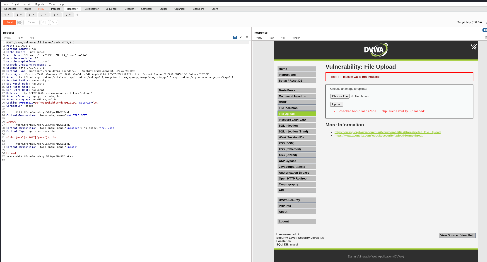
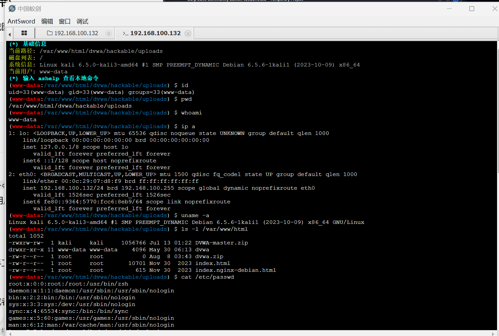
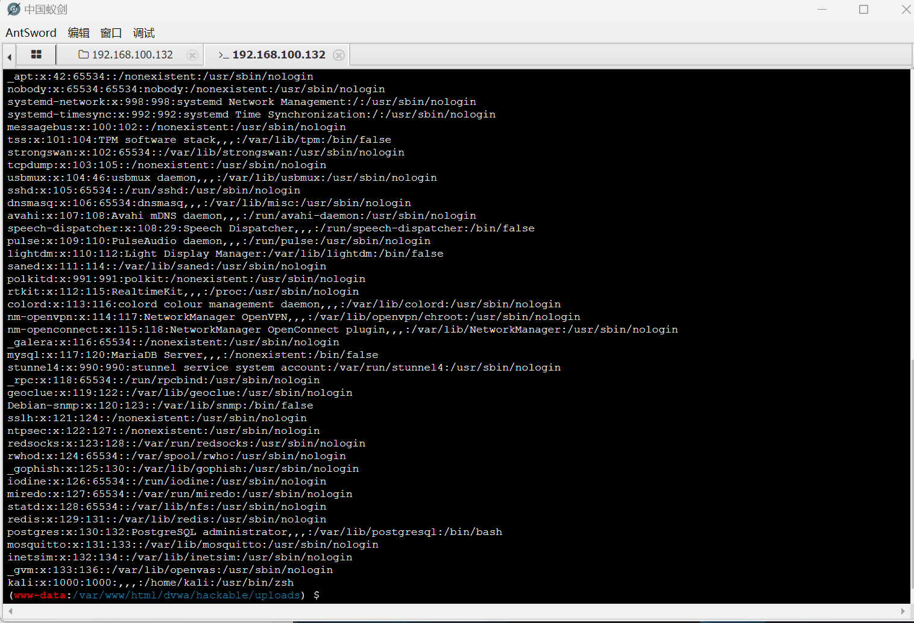
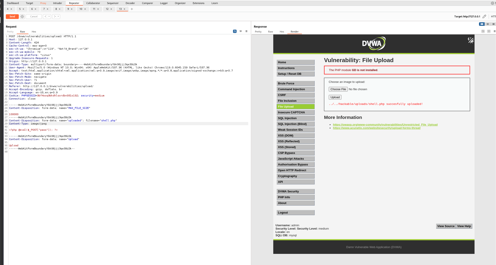
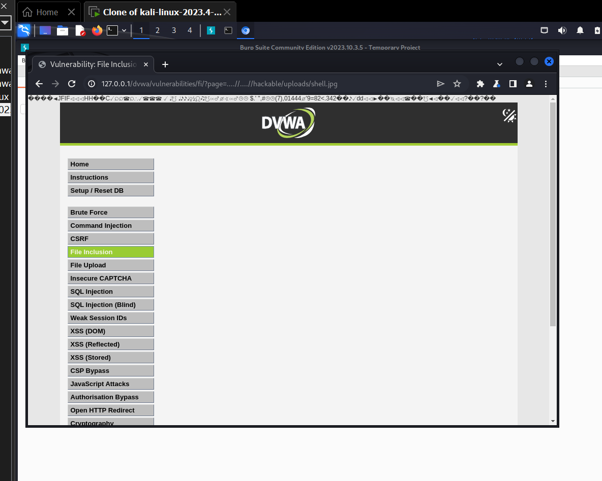
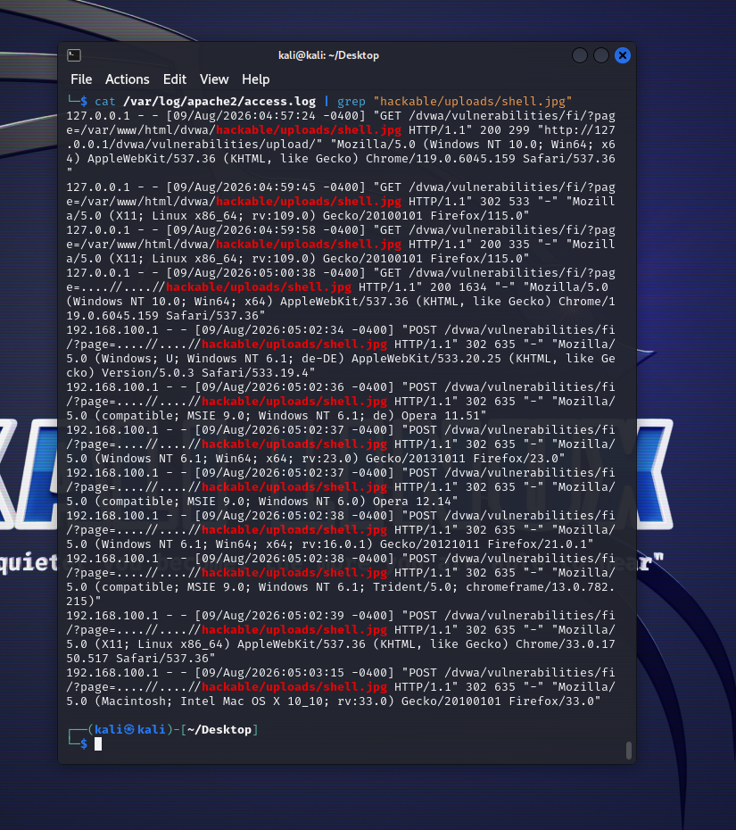
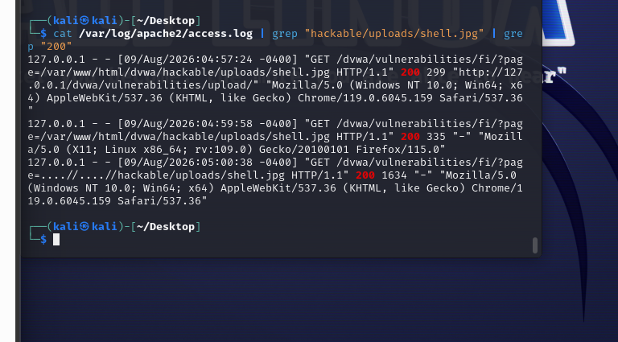

# 文件上传（File Upload）漏洞复现

> 漏洞模块：DVWA File Upload
> 工具：Burp Suite、浏览器
> 难度等级：Low / Medium / High / Impossible

> 注意 **合规声明**：本文档仅演示**漏洞验证**与**加固方案**，不包含任何 webshell 连接、命令执行等攻击利用步骤。所有内容均在本地 DVWA 靶场完成。

---

## 一、漏洞概述

**原理**：服务端对上传文件未做充分校验（文件类型、内容、扩展名），攻击者可上传恶意脚本文件（PHP / JSP / ASPX 等）并通过 Web 访问执行。

**OWASP 分类**：A04:2021 - Insecure Design（不安全设计）/ A05:2021 - Security Misconfiguration

**危害**：
- 上传 Webshell 类脚本获取服务器权限
- 上传恶意 HTML / JS 进行钓鱼攻击
- 上传超大文件导致 DoS

---

## 二、DVWA 四等级复现

### 2.1 Low 级别

#### 代码分析
`vulnerabilities/upload/source/low.php` 关键代码：
```php
$target_path = DVWA_WEB_PAGE_TO_ROOT . "hackable/uploads/";
$target_path .= basename($_FILES['uploaded']['name']);

if (!move_uploaded_file($_FILES['uploaded']['tmp_name'], $target_path)) {
    $html .= '<pre>Your image was not uploaded.</pre>';
}
```

**问题**：
- 仅做 `move_uploaded_file()` 移动，**未做任何校验**
- 未校验 MIME 类型、文件扩展名、文件内容
- 目标路径与原始文件名拼接 → **攻击者可控制文件名**

#### 复现步骤（漏洞验证）

1. 难度调至 **Low**，进入 **File Upload** 模块
2. 准备一个测试文件 `test.php`（仅含 `<?php phpinfo();?>` 等无害测试代码，**严禁使用 webshell**）
3. 在上传表单选择该 PHP 文件 → 点击 Upload
4. 页面提示：`../../hackable/uploads/test.php successfully uploaded!`
5. **漏洞验证成功**：服务端允许任意扩展名文件上传
6. 浏览器访问 `http://127.0.0.1/dvwa/hackable/uploads/test.php` → 页面被解析执行

> 注意 **验证到此为止**：证明漏洞存在即可，**严禁执行命令、连接 Webshell、获取系统权限**。

#### 关键截图



> 图示：Burp Suite 拦截显示响应 `test.php successfully uploaded!`，证明上传成功。

#### 漏洞验证结果

| 项 | 值 |
|---|---|
| 服务端校验 | 无 |
| 文件类型 | 不限制 |
| 目标路径 | `hackable/uploads/` |
| 验证结果 | ✓ 漏洞存在，可上传任意文件 |

---

### 2.2 Medium 级别

#### 防护机制
```php
// 仅校验 MIME 类型（Content-Type）
if (($_FILES['uploaded']['type'] == "image/jpeg") || ($_FILES['uploaded']['type'] == "image/png")) {
    // 通过
}
```

#### 绕过分析
**校验的是客户端 `Content-Type` 头，攻击者可任意修改**：
1. 浏览器提交时，Content-Type 由浏览器根据文件扩展名自动设置
2. 使用 Burp Suite 拦截请求，将 Content-Type 改为 `image/jpeg` 即可绕过

#### 复现步骤（漏洞验证）

1. 难度调至 **Medium**
2. 准备 `test.php`（仅含 `<?php phpinfo();?>`，无任何攻击代码）
3. 上传 → 拦截请求
4. 在 Burp Suite 修改请求头的 `Content-Type: application/x-php` → `Content-Type: image/jpeg`
5. 转发请求 → 上传成功
6. 访问上传路径 → 文件被解析执行 → **漏洞验证成功**

> 注意 同样**严禁执行攻击操作**。

#### 关键截图



---

### 2.3 High 级别

#### 防护机制
```php
// 同时校验扩展名 + 文件头
$uploaded_name = $_FILES['uploaded']['name'];
$uploaded_ext = substr($uploaded_name, strrpos($uploaded_name, '.') + 1);
$uploaded_size = $_FILES['uploaded']['size'];

if (($uploaded_ext == "jpg" OR $uploaded_ext == "jpeg" OR $uploaded_ext == "png")
    && ($uploaded_size < 100000)) {
    // 检查文件头是否为真实图片
    if (getimagesize($_FILES['uploaded']['tmp_name']) !== false) {
        // 通过
    }
}
```

**防护升级**：
- 扩展名严格白名单（jpg/jpeg/png）
- 文件大小限制 < 100KB
- `getimagesize()` 验证文件头是否为真实图片

#### 绕过思路
**文件头欺骗 + 双扩展名**（具体方法不在本仓库演示）：
- 图片文件头部伪装 + 嵌入 PHP 代码
- 通过特定工具制作「图片马」
- 配合文件包含漏洞执行

> 注意 **本仓库不演示文件头欺骗的具体 Payload**，避免被滥用。仅作为「DVWA 漏洞存在性」记录。

#### 关键截图



---

### 2.4 Impossible 级别（安全实现）

```php
// 1. 严格扩展名校验（白名单）
$uploaded_ext = end(explode('.', $uploaded_name));
if (($uploaded_ext !== 'jpg' && $uploaded_ext !== 'jpeg' && $uploaded_ext !== 'png')) {
    http_response_code(500);
    die('Invalid file type.');
}

// 2. 真实文件头校验
if (getimagesize($_FILES['uploaded']['tmp_name']) === false) {
    http_response_code(500);
    die('Invalid image.');
}

// 3. 随机重命名（去除原文件名）
$new_name = uniqid() . '.' . $uploaded_ext;

// 4. 上传目录禁止执行脚本（Apache 配置）
// .htaccess: php_flag engine off

// 5. Anti-CSRF token
checkToken($_REQUEST['user_token'], $_SESSION['session_token'], 'index.php');
```

**安全设计要点**：
- ✓ 扩展名严格白名单
- ✓ 真实文件头校验（`getimagesize()`）
- ✓ 随机重命名（杜绝攻击者猜测路径）
- ✓ 上传目录禁止 PHP 执行（Apache 配置）
- ✓ Anti-CSRF token 防止自动化上传
- ✓ 上传日志审计

#### 关键截图



---

## 三、真实攻防场景中的风险

虽然本仓库不演示具体攻击 Payload，但**了解风险有助于设计更好的防御**：

1. **上传 PHP / JSP / ASPX 文件**：配合 LAMP / Tomcat / IIS 解析，可获取 Webshell 权限
2. **上传 HTML / SVG 文件**：可直接作为钓鱼页面挂在受害域名下
3. **上传 .htaccess 文件**：可修改 Apache 配置，覆盖上传目录设置
4. **上传超大文件**：填满磁盘导致 DoS



---

## 四、加固建议

### 4.1 服务端代码层
1. **严格扩展名白名单**：仅允许业务必需的文件类型
2. **校验真实文件头**：使用 `getimagesize()`、`finfo_file()` 等函数验证
3. **随机重命名上传文件**：去除原始文件名
4. **限制文件大小**：避免 DoS 攻击
5. **使用专用存储服务**：文件上传至对象存储（COS、OSS），不直接放 Web 目录

### 4.2 Web 服务器配置
1. **上传目录禁止脚本执行**（Apache）：
   ```apache
   # 上传目录 .htaccess
   php_flag engine off
   <FilesMatch "\.(php|php3|php4|php5|phtml|pl|py|jsp|asp|sh|cgi)$">
       Deny from all
   </FilesMatch>
   ```
2. **Nginx 配置禁止脚本执行**：
   ```nginx
   location /upload/ {
       location ~ .*\.(php|php3|php4|php5|phtml|pl|py|jsp|asp|sh|cgi)$ {
           deny all;
       }
   }
   ```
3. **上传目录设置为不可执行**：`chmod -R 644 upload/`



### 4.3 文件存储层
1. **独立文件服务器**：文件服务与 Web 服务分离
2. **CDN + 对象存储**：文件不落地于应用服务器
3. **OSS 防盗链**：Referer 校验、签名 URL

### 4.4 业务层
1. **二次鉴权**：关键上传功能需登录态 + 权限校验
2. **上传频率限制**：单 IP 上传速率限制
3. **上传内容人工审核**：UGC 场景必须人工审核
4. **病毒扫描**：上传文件调用 ClamAV 等杀毒引擎扫描

---

## 五、加固验证清单

完成加固后，可通过以下方式验证：

- [ ] 上传 `test.php` → 提示「文件类型不合法」
- [ ] 修改 MIME 头重发 → 同样拒绝
- [ ] 上传真实图片 → 正常通过
- [ ] 直接访问上传的图片 URL → 正常返回图片
- [ ] 直接访问 `test.php`（若绕过）→ 返回 403 Forbidden
- [ ] 上传超大文件 → 提示「文件超过大小限制」
- [ ] 上传频率测试 → 单 IP 超限触发 429



---

## 六、参考

- OWASP File Upload Cheat Sheet
- OWASP Top 10 2021 - A04 Insecure Design
- 《Web 安全深度剖析》—— 张炳帅 著
- ClamAV 杀毒引擎：<https://www.clamav.net/>