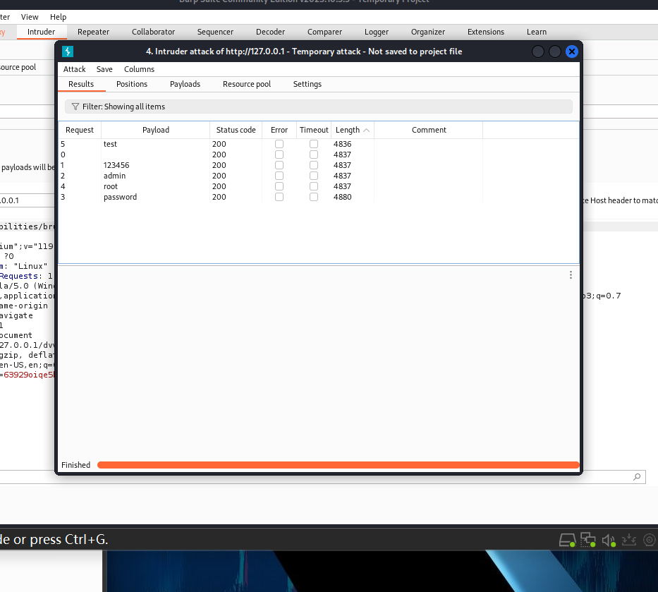
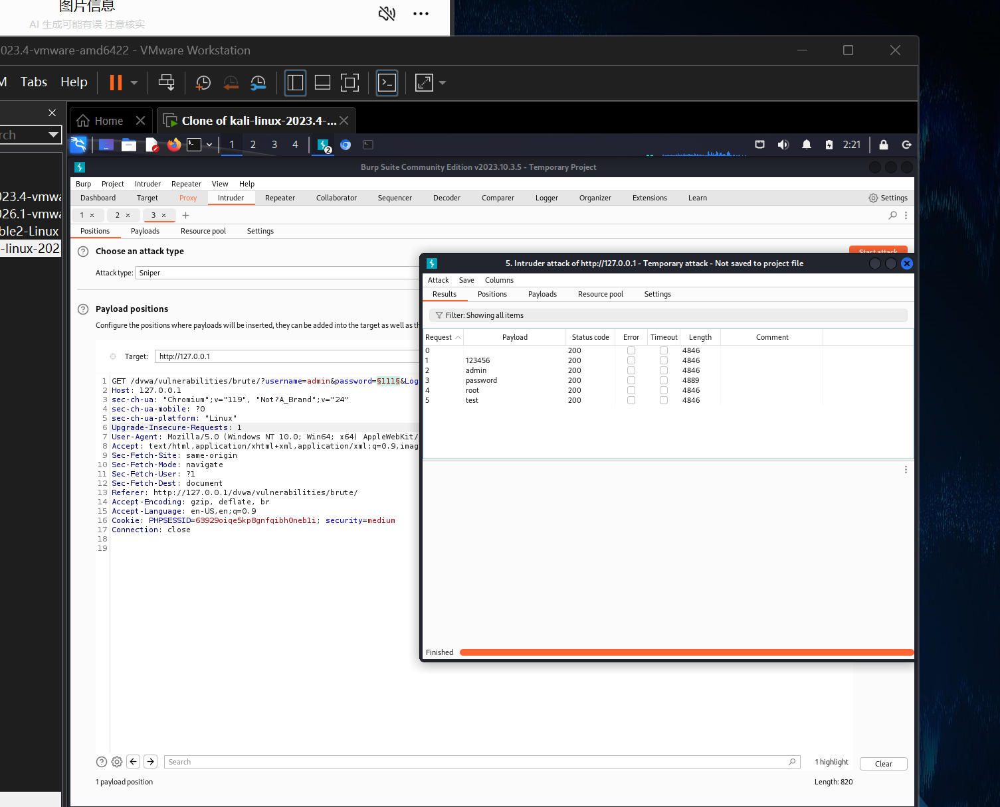

# 暴力破解（Brute Force）漏洞复现

> 漏洞模块：DVWA Brute Force
> 工具：Burp Suite Community Edition v2023.10
> 难度等级：Low / Medium / High

---

## 一、漏洞概述

**原理**：服务端未对登录请求做失败次数限制、未使用强验证码、未引入账户锁定机制，导致攻击者可通过高频请求穷举账号密码。

**OWASP 分类**：A07:2021 - Identification and Authentication Failures（识别与认证失败）

**危害**：
- 直接获取系统账号权限
- 可被用于撞库攻击其他平台（同密码复用）
- 暴露用户账号体系

**合规声明**：本文档所有内容均在本地 DVWA 靶场复现，仅用于安全学习与原理研究。

---

## 二、DVWA 四等级复现

### 2.1 Low 级别

#### 代码分析
`vulnerabilities/brute/source/low.php` 未做任何输入过滤或登录限制：
```php
// 核心逻辑（简化）
$result = mysqli_query($GLOBALS["___mysqli_ston"], "SELECT * FROM users WHERE user='$user' AND password='$pass'");
```

直接拼接 SQL 语句，且无失败计数、无延迟。

#### 复现步骤

1. 设置 DVWA Security 为 **Low**，进入 **Brute Force** 模块
2. 输入已知账号 `admin`，密码留空
3. 开启 Burp Suite 拦截浏览器请求，提交登录
4. 在 Burp Suite **Proxy → HTTP History** 中找到该 GET 请求
5. 右键 → **Send to Intruder**
6. 进入 **Intruder → Positions**，清空所有标记，仅给密码字段 `password=§§` 添加标记
7. **Attack type** 选择 **Sniper**（单字典单位置）
8. **Payloads → Payload type** 选择 **Simple list**，导入常用弱密码字典（如 top1000.txt）
9. 启动攻击，观察 **Length** 列差异

#### 关键截图



如图所示，`password` 字段返回的响应 Length（4880）与其他密码响应（4837）不一致，可判定为正确密码。

**爆破结果**：`admin / password`

---

### 2.2 Medium 级别

#### 防护机制
服务端在登录失败后增加 `sleep(2)` 延迟：
```php
// 简化逻辑
if (mysqli_num_rows($result) == 0) {
    sleep(2);  // 延迟 2 秒
    $html .= "<pre><br />Username and/or password incorrect.</pre>";
}
```

#### 绕过思路
延迟仅影响响应速度，不影响最终结果正确性。**调整 Intruder 请求节流即可绕过**。

#### 复现步骤

1. 设置难度为 **Medium**
2. 同样使用 Burp Suite Intruder Sniper 模式
3. 在 **Intruder → Resource Pool** 中配置：
   - **Maximum concurrent requests**: 1
   - **Delay between requests**: 2000 ms（对应服务端 sleep(2)）
4. 启动攻击，观察 Length 差异

#### 关键记录

| 参数 | 值 |
|---|---|
| 靶场难度 | Medium |
| Payload 位置 | GET 参数 password |
| 节流配置 | 2000 ms |
| 请求方法 | GET（携带 Cookie：PHPSESSID、security=medium） |
| 爆破结果 | `admin / password` |

---

### 2.3 High 级别

#### 防护机制
- 登录请求新增 **user_token** 一次性令牌（CSRF 防护）
- 每次请求必须携带最新的 token，旧 token 立即失效
- 这是经典的「带 token 防爆破」机制

#### 绕过难点
Burp Suite **Community 版不支持 Macros 宏**，无法自动刷新 token，导致 Intruder 批量爆破失败（每次请求都因 token 失效而报错）。

#### 绕过方案：Repeater 手动爆破

利用 Burp Suite **Repeater** 手动测试：

1. 难度调至 **High**，浏览器打开登录页，复制页面 HTML 中的 `user_token` 隐藏字段值
2. 在 Repeater 中构造完整 GET 请求：`?username=admin&password=§&Login=Login&user_token=最新token`
3. 每次测试前**手动刷新登录页获取最新 token**
4. 依次替换密码字典中的每个候选值，逐个重放
5. 对比响应内容，找到密码正确的请求

#### 关键截图



#### 爆破结果

| 字段 | 值 |
|---|---|
| 请求方法 | GET |
| 防护机制 | user_token 一次性令牌 |
| 工具版本 | Burp Suite Community（不支持 Macros） |
| 绕过方式 | Repeater 手动刷新 token + 逐密码重放 |
| 爆破结果 | `admin / password` |

---

### 2.4 Impossible 级别（安全实现参考）

查看 `vulnerabilities/brute/source/impossible.php` 关键安全措施：

```php
// 1. PDO 预编译参数化查询，杜绝 SQL 注入
$data = $db->prepare('SELECT * FROM users WHERE user = (:user) AND password = (:pass)');
$data->bindParam(':user', $user);
$data->bindParam(':pass', $pass);

// 2. 登录失败后随机延时 0~3 秒，降低爆破效率
sleep(rand(0, 3));

// 3. CSRF token 校验
checkToken($_REQUEST['user_token'], $_SESSION['session_token'], 'index.php');

// 4. 失败 3 次后账户锁定 15 分钟（reCAPTCHA 验证后解锁）
if ($failed_login >= 3) {
    // 触发 reCAPTCHA + 账户锁定
}
```

**安全设计要点**：
- ✓ 参数化查询
- ✓ 随机化延时
- ✓ 强 CSRF Token
- ✓ 失败计数 + 账户临时锁定
- ✓ reCAPTCHA 验证码

---

## 三、工具联动

| 工具 | 在本漏洞中的作用 |
|---|---|
| **Burp Suite Intruder** | 批量自动化爆破（适合 Low / Medium） |
| **Burp Suite Repeater** | 手动重放（适合 High 带 token 场景） |
| **Burp Suite Comparer** | 对比两个响应差异 |
| **hydra（可选）** | 命令行爆破工具，适合协议层（SSH/FTP） |

---

## 四、加固建议

1. **强制账户锁定策略**：连续失败 5 次锁定账户 30 分钟，运维介入解锁
2. **引入多因素认证（MFA）**：短信、邮件、TOTP 令牌
3. **密码复杂度策略**：最少 12 位、含大小写数字特殊字符、定期更换
4. **登录日志告警**：同一 IP 短时间大量失败登录触发告警
5. **关键业务页面加 reCAPTCHA**：区分人机行为
6. **服务端使用参数化查询**：杜绝 SQL 注入导致认证绕过
7. **使用 bcrypt / Argon2 慢哈希**：增加单次验证耗时，降低爆破效率

---

## 五、参考

- OWASP Authentication Cheat Sheet
- OWASP Top 10 2021 - A07 Identification and Authentication Failures
- DVWA 官方文档 Brute Force 模块